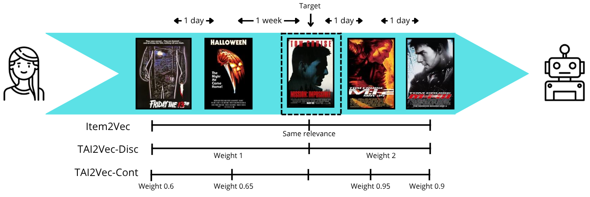
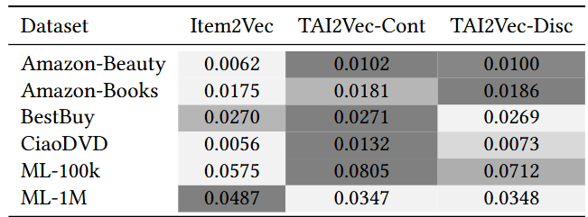
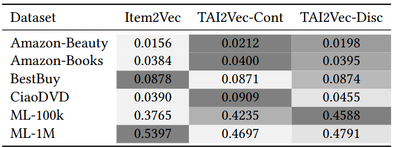
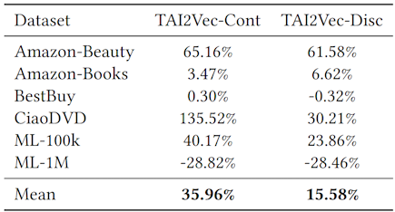
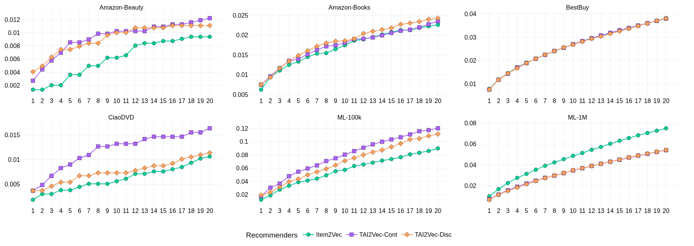
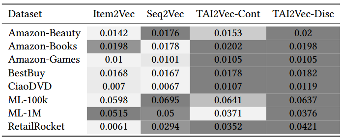
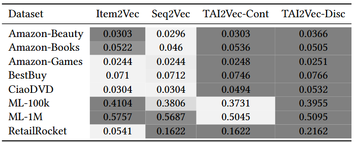
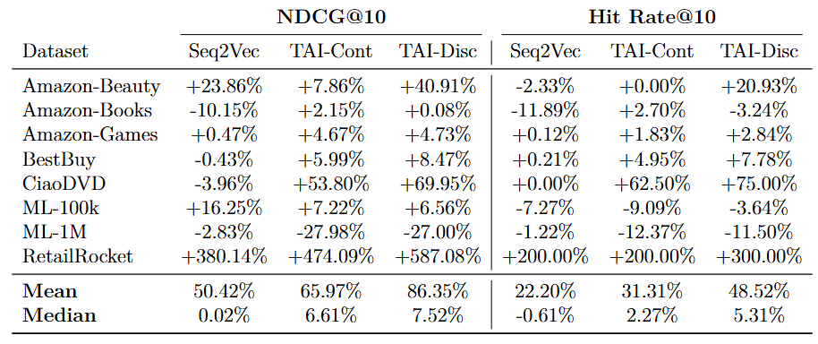
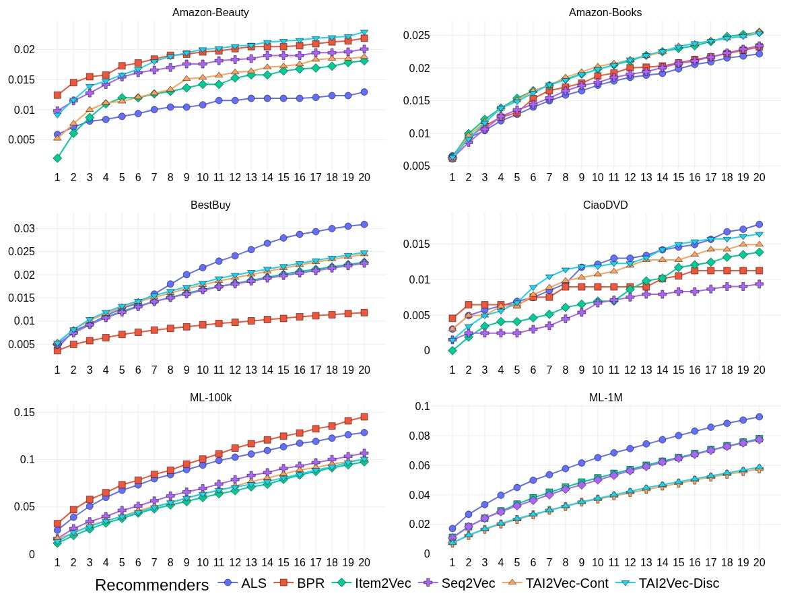
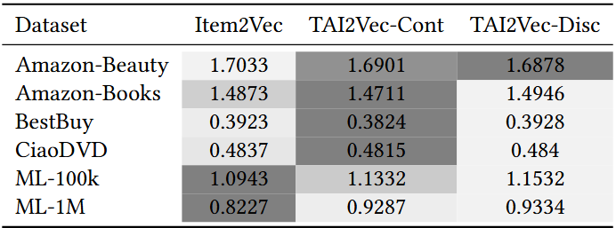

# TAI2Vec

Official repository for the paper "_Learning Behaviorally Grounded Item Embeddings via Personalized Temporal Contexts_"

## Abstract

Effective user modeling requires distinguishing between short-term and long-term preference evolution. While item embeddings have become a key component of recommender systems, standard approaches like Item2Vec treat user histories as unordered sets (bag-of-items), implicitly assuming that interactions separated by minutes are as semantically related as those separated by months. This simplification flattens the rich temporal structure of user behavior, obscuring the distinction between coherent consumption sessions and gradual interest drifts. In this work, we introduce TAI2Vec (Time-Aware Item-to-Vector), a family of lightweight embedding models that integrates temporal proximity directly into the representation learning process. Unlike approaches that apply global time constraints, TAI2Vec is user-adaptive, tailoring its temporal definitions to individual interaction paces. We propose two complementary strategies: TAI2Vec-Disc, which utilizes personalized anomaly detection to dynamically segment interactions into semantic sessions, and TAI2Vec-Cont, which employs continuous, user-specific decay functions to weigh item relationships based on their relative temporal distance. Experimental results across six diverse datasets demonstrate that TAI2Vec consistently produces more accurate and behaviorally grounded representations than static baselines, achieving competitive or superior performance in over 80\% of the datasets, with improvements of up to 135\%.

## Key achievements

* **A User-Centric Temporal Framework:** We propose a novel perspective for item embedding learning where temporal relevance is defined dynamically by the user’s individual interaction pace, rather than fixed global time units;
* **Adaptive Modeling Strategies:** We introduce two time-aware mechanisms - discrete segmentation via anomaly detection and continuous weighting via statistical normalization - to implement temporal proximity in embedding training;
* **Empirical Validation:** We demonstrate through extensive experiments on six diverse datasets that TAI2Vec consistently produces more accurate and behaviorally grounded representations than static baselines, achieving competitive or superior performance in over 80\% of the datasets, with improvements of up to 135\% in sparse interaction scenarios.

## Visual representation



Visual comparison between Item2Vec and the two TAI2Vec variants. A user interaction sequence is illustrated as a sequence of consumed items annotated with their temporal intervals. Item2Vec assumes a static co-occurrence context, assigning equal importance to all items within the same user history. TAI2Vec-Disc introduces discrete temporal segmentation, creating sub-contexts that prioritize interactions within specific time windows. TAI2Vec-Cont shapes temporal proximity continuously, assigning interaction weights dynamically based on the temporal distance between items.

## Results 80:10:10 split

### Comparison of recommenders for NDCG@10



### Comparison of recommenders for Hit Rate@10



### Percentage improvement of TAI2Vec recommenders for NDCG@10 in comparison with Item2Vec



### Average NDCG@N results for multiple values of N across different datasets



## Results 70:15:15 split

### Comparison of recommenders for NDCG@10



### Comparison of recommenders for Hit Rate@10



### Percentage improvement of TAI2Vec recommenders for NDCG@10 in comparison with Item2Vec



### Average NDCG@N results for multiple values of N across different datasets



### RMSE in rating prediction task



## Installation

Before executing the scripts, it is important to install the necessary datasets and Python libraries. The following two subsections explain how to do that.

### Python libraries

The recommended way to install the Python libraries necessary to run the experiments is to use an Anaconda environment. You can create it with the command below:

```
conda env create --name tai2vec --file=environment.yml
```

With the environment created, you must activate it to be able to run the experiments:

```
conda activate tai2vec
```

Another way to install the libraries is using the `requirements.txt` file (although this is not recommended). The Python version 3.10.18 is recommended. You can then install the libraries with the command below:

```
python -m pip install -r requirements.txt
```

### Datasets

Downloading the datasets is necessary to run the experiments. A list with download link and where to save the files are given below:

- [AmazonBeauty](https://mcauleylab.ucsd.edu/public_datasets/data/amazon_2023/raw/review_categories/All_Beauty.jsonl.gz): put `All_Beauty.jsonl` file in `raw/amazon-beauty`
- [AmazonBooks](https://www.kaggle.com/datasets/mohamedbakhet/amazon-books-reviews): download and extract in `raw/amazon-books`
- [BestBuy](https://www.kaggle.com/c/acm-sf-chapter-hackathon-big/data?select=train.csv): put `train.csv` file in `raw/bestbuy`
- [CiaoDVD](https://guoguibing.github.io/librec/datasets.html): download `ciaodvd.zip` and extract `movie-ratings.txt` file in `raw/ciaodvd`
- [MovieLens-100K](https://grouplens.org/datasets/movielens/): download `ml-100k.zip` in the `MovieLens 100K Dataset` section and extract it in `raw/ml-100k`
- [MovieLens-1M](https://grouplens.org/datasets/movielens/): download `ml-1m.zip` in the `MovieLens 1M Dataset` section and extract it in `raw/ml-1m`

## Executing the experiments

With all the installation done, you can proceed to the scripts execution. The following subsections explain the necessary scripts to execute in order to reproduce our results.

### Preprocess datasets

With the raw datasets downloaded, it's necessary to preprocess them before generating the recommendations.
To do that, execute the following command:

```
python src/scripts/preprocess.py
```

Executing this Python code will ask you which datasets to preprocess. Input the dataset indexes separated by a space to select the datasets.

Another way to select the datasets is by executing the command below:

```
python scripts/preprocess.py --datasets <datasets>
```

Replace `<datasets>` with the names (or indexes) of the datasets separated by commas (","). The available datasets to preprocess are:

- \[1\]: amazon-beauty
- \[2\]: amazon-books
- \[3\]: bestbuy
- \[4\]: ciaodvd
- \[5\]: ml-100k
- \[6\]: ml-1m
- all (it will use all datasets)

### Run the recommendation methods

After preprocessing the datasets, you can proceed to the recommendation and evaluation script (main). You can execute it with:

```
python scripts/main.py
```

Executing this Python code will ask you which datasets and recommenders to use. Input the datasets and recommenders indexes separated by spaces to select them.

Another way to select the datasets and recommenders is by executing the command below:

```
python scripts/main.py --datasets <datasets> --recommenders <recommenders>
```

Replace `<datasets>` with the names (or indexes) of the datasets separated by commas (","). The available datasets to use are:

- \[1\]: amazon-beauty
- \[2\]: amazon-books
- \[3\]: bestbuy
- \[4\]: ciaodvd
- \[5\]: ml-100k
- \[6\]: ml-1m
- all (it will use all datasets)

Replace `<recommenders>` with the names (or indexes) of the recommenders separated by commas (","). The available recommenders to use are:

- \[1\]: ALS
- \[2\]: BPR
- \[3\]: Item2Vec
- \[4\]: TimeI2V_Disc_Aug
- \[5\]: TimeI2V_Cont
- all (it will use all recommenders)

### Generate metrics and plots

After executing the main code, you can plot the results. To do so, execute the following command:

```
python scripts/generate_plots.py
```

Executing this Python code will ask you which datasets and recommenders to use. Input the datasets and recommenders indexes separated by spaces to select them.

Another way to select the datasets and recommenders is by executing the command below:

```
python scripts/generate_plots.py --datasets <datasets> --recommenders <recommenders>
```

Replace `<datasets>` with the names (or indexes) of the datasets separated by commas (","). The available datasets to use are:

- \[1\]: amazon-beauty
- \[2\]: amazon-books
- \[3\]: bestbuy
- \[4\]: ciaodvd
- \[5\]: ml-100k
- \[6\]: ml-1m
- all (it will use all datasets)

Replace `<recommenders>` with the names (or indexes) of the recommenders separated by commas (","). The available recommenders to use are:

- \[1\]: ALS
- \[2\]: BPR
- \[3\]: Item2Vec
- \[4\]: TimeI2V_Disc_Aug
- \[5\]: TimeI2V_Cont
- all (it will use all recommenders)

The plots will be saved in the `figures` folder.
